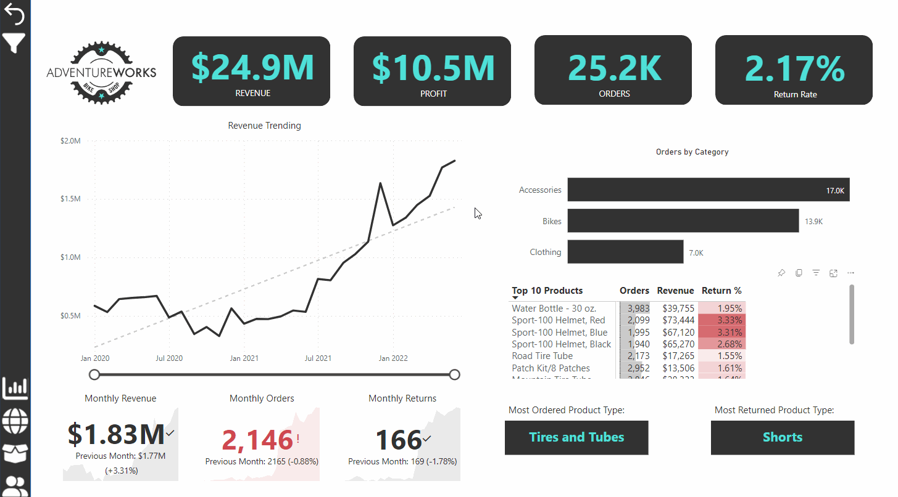
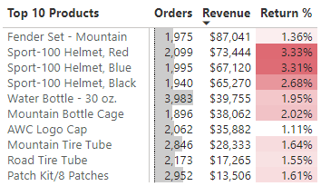
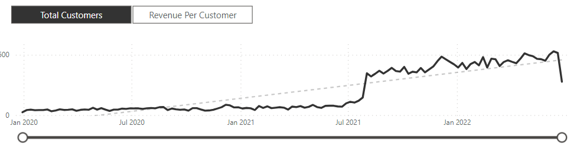
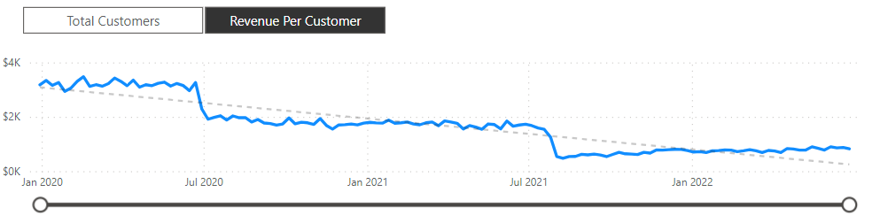

# AdventureWorks

A Microsoft Power BI business intelligence dashboard for AdventureWorks, a fictional global manufacturing company that produces cycling equipment and accessories.

The dataset was supplied with the [Maven Analytics Power BI Desktop course](https://mavenanalytics.io/course/microsoft-power-bi-desktop). This data was derived from the [AdventureWorks sample databases](https://learn.microsoft.com/en-us/sql/samples/adventureworks-install-configure) available from Microsoft.

The customer base is spread across 6 countries on 3 continents: Australia, Canada, France, Germany, United Kingdom and United States. Sales and return data is available for the period between 01/01/2020 and 30/06/2022. Customer profiles include date of birth, annual income, education level, number of children, occupation and homeowner status. 

## Features

- Track key performance indicators (KPIs) related to sales, revenue, profit, and returns.
- Compare performance across different regions.
- Analyse product-level trends.
- Identify high-value customers.

## Project Highlights

This project involved the following tasks:

- connecting and transforming the raw data 
- building a relational data model
- creating calculated columns and measures using **DAX**
- Created a rolling calendar using **PowerQuery M code**
- building an interactive dashboard

## Dashboard Elements

#### Executive Summary View

- high-level KPIs for revenue, profit, orders and return rates
- page-level filtering by product and product category
- drill-through per product to product detail view

#### Map View

- total orders per country

#### Product Detail View

- per-product performance against order, revenue and profit targets
- "what if" analysis via price adjustment shows adjusted profit

#### Customer Detail View

- total customer and per-customer revenue analysis

#### Custom UI Elements

- filter pane for filtering by year and geography
- custom tooltip for product category order metrics

### Insights

- Approximately $24.9 million in revenue and $10.5 million in profit was generated between 01/01/2020 and 30/06/2022. There is an appreciable dip in revenue between 01/06/2020 and 01/11/2020 (possibly due to the simulated impact of the COVID-19 pandemic), after which revenue appears to grow linearly. December 2021 was an exceptional year in terms of revenue at $1.64 million, and it would be worth investigated the cause of this. Was this due to a highly successful seasonal campaign, e.g. a Black Friday promotion?

- Understandably, tires and tubes are the most ordered product type, while cycling shorts are the most returned product type. After mountain bike fenders, sports helmets top the list of revenue-generating products, despite having relatively high return rates:

- The most profitable product categories are clothing and accessories.

- There is a step change (on the order of 200 customers per week) in total weekly customers beginning 02/08/2021.

- However, revenue per customer has been declining year-on-year:

- While the United States is the largest market with 8,700 orders and $7.94 million in total revenue, The Australian market has the largest revenue per customer at $2,131.
